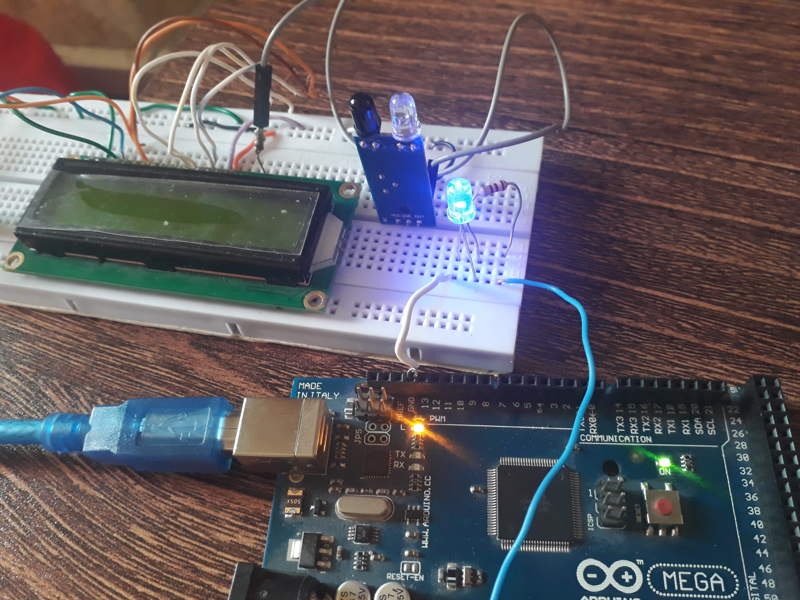

# IR_sensor
ROS Serial Arduino IR Sensor Integration

In Ros 
In order to connect IR sensor Digital or Analog with Arduino and to write a publisher for it and then controller able to subscribes it is not a difficult task, here is a simple code and interfacing IR to Arduino.

  
   
  Fig.

# YOUTUBE VIDEO LINK:
https://youtu.be/gUilHSGGWyk
